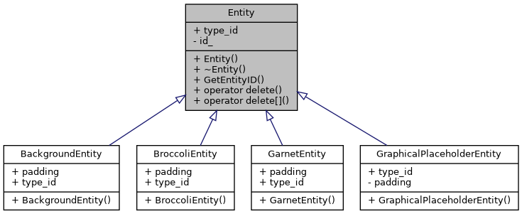
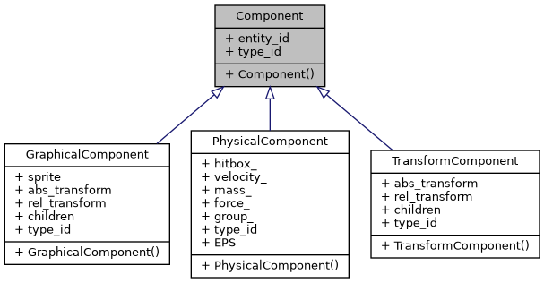
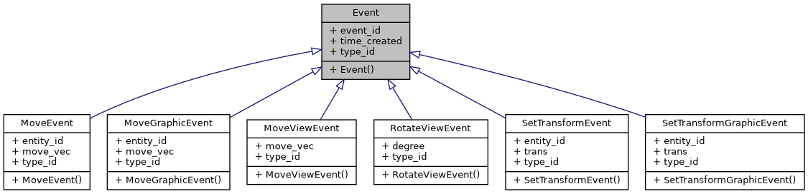
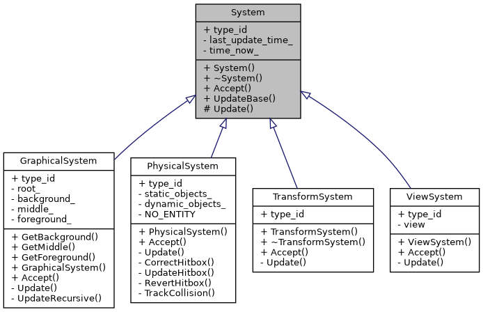
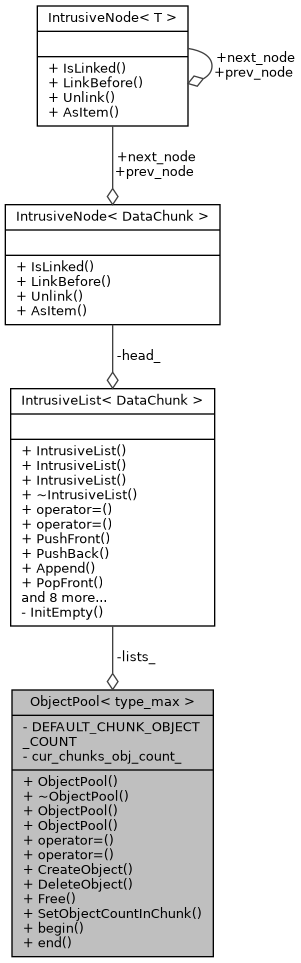
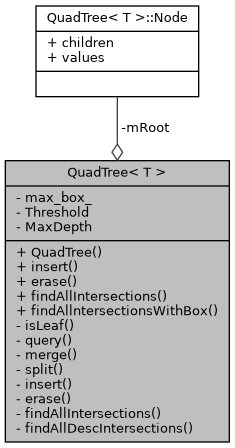

# Effective Brocolli
An *effective* realization of an Entity Component System game engine.

## Engine Structure
This section disusses the structure of the engine by providing illustrations of classes which lay the foundation of the engine in form of UML diagrams.

### Entities
Entity's only purpose is to exist somewhere in an Object Pool to bind systems to components via `entity_id` that the entity holds. Also, the descendants of the class may perform various actions during construction in order to create components and bind them to the `entity_id`. The following diagram depicts sample Entities:


### Component type
Components are bound to entities to provide necessary visuals, sounds, physics that are related to the entity. They are manipulated by systems. The following diagram depicts sample Components:


### Event
Events are generated and are accepted by systems. They inform the systems of various types of events, such as collisions or moving, providing the data needed in order to process it. The following diagram depicts sample Events:


### Systems
Systems hold the most of logic in the engine. They alter components and catch events to make progress of the game. The following diagram depicts sample Systems:


### Object pool
In order to optimize storage usage, which is constantly bombarded with requests of creating and deleting entities and components, an Object Pool class was developed. It uses a simple interface, similair to that of operators `new` and `delete`, and makes use of optimized chunked-array-style structure for storage of objects of the same type and intrusive list for linking these structures in once again, optimized way.


### Quad Tree
A sample class which provides an awareness of physical objects in a given area for the physical system ih an optimized fashion.


## Build
```shell
mkdir build && cd build
cmake .. # "-UBUILD_TESTS -DBUILD_TESTS=ON" to build tests
make
```

## Build documentation
```shell
doxygen
```
Documentation shall be generated in the directory named `docs`.
